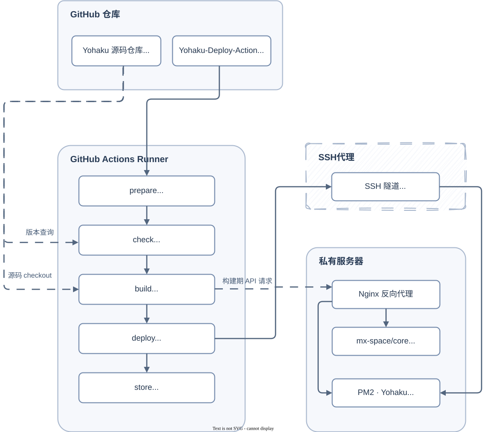
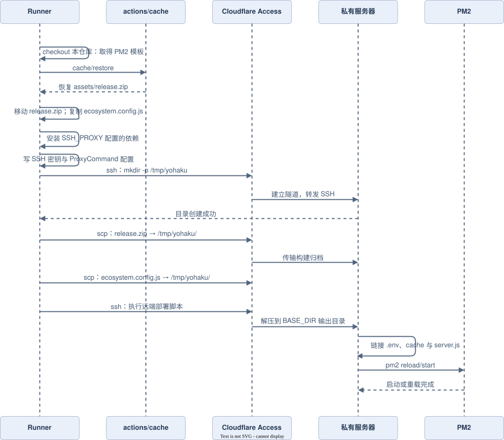
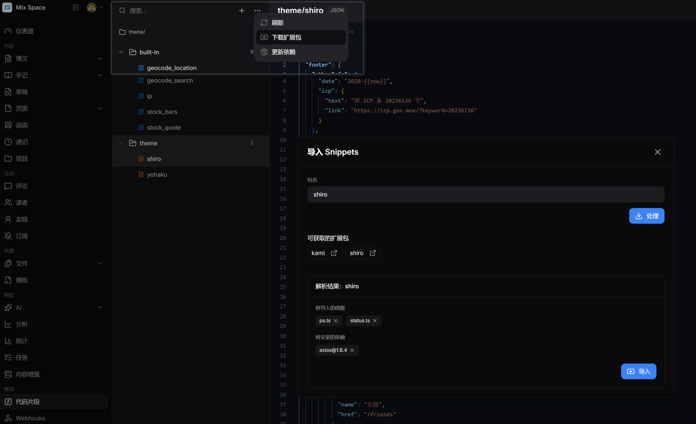
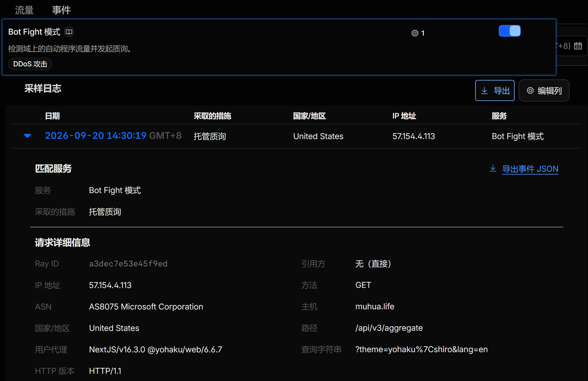

# Yohaku 全流程部署实践记录

> 本文档是 [readme.md](../readme.md) 和 [post-guide.md](./post-guide.md) 的补充说明；
> 聚焦于「本地用 `act` 调试 → 排障 → 最终跑通完整部署链路」的实际部署过程。
> 包含整体架构图、时序图、踩过的坑与修复方式、以及 mx-space 后端配套注意事项。

[toc]

---

## 1. 整体架构

整个体系由 **三部分** 组成：闭源的 Yohaku 前端源码仓库、公开的 `Yohaku-Deploy-Action` 工作流仓库、以及私有服务器上的 `mx-space` 后端 + `PM2` 运行时。

私有服务器需要提供运行环境：node、npm、pnpm、pm2、sharp。

工作流仓库不包含任何前端源码，只负责「拉源码 → 构建 → 通过 SSH 部署」。



详细配置参见 [环境变量](../readme.md#环境变量) 。

---

## 2. GitHub Actions 流水线

工作流文件：[.github/workflows/deploy.yml](./.github/workflows/deploy.yml)。

本地调试参见：[本地调试 Workflow](../readme.md#本地调试-Workflow)。

5 个 Job 依次执行，任一失败下游即中止：


- **`prepare`**：checkout **工作流仓库自身**，读取上次成功构建时写入的`.github/deploy_build_hash` 文件内容。
- **`check`**：checkout **源码仓库**（`SOURCE_REPO`），比较当前 `HEAD` 短哈希与 `.github/deploy_build_hash` 是否一致；一致则说明源码无变化，
  设置 `canceled=true`，后续 `build`/`deploy`/`store` 都会因 `if: needs.check.outputs.canceled != 'true'` 被跳过。
- **`build`**：再次 checkout 源码仓库，将 `.next` standalone 输出打包为`assets/release.zip`，再用 `actions/cache/save` 存起来；**不是** `actions/upload-artifact`，避免产物在 Actions UI 里可下载/占用配额）。
- **`deploy`**：**必须先 `actions/checkout@v4` 本仓库自身**（拿到 `pm2/ecosystem.config.js` 模板），再用`actions/cache/restore` 取回上一步缓存的 `release.zip`，建立 SSH 隧道，如果配置了代理则通过代理建立隧道，如 `cloudflared；然后将产物 zip 和 PM2 配置传到服务器并远程执行部署脚本（reload/start PM2）。
- **`store`**：把 `build` job 产出的 commit 短哈希写回 `.github/deploy_build_hash` 文件并提交推送，供下次 `check` 比对，形成「幂等」触发链路。

---

## 3. Deploy Job 详细时序

`deploy` job 内部是一串强依赖顺序的 shell 步骤，任何一步失败都会导致产物没能落地服务器。用时序图展示一次成功部署的完整交互：



远端部署脚本的删除出目录布局；下述 `build_dir` 命名规则为 `构建编号_$(date +%Y%m%d_%H%M%S)`：

```
$BASE_DIR/                       # 默认 $HOME/yohaku；可通过环境变量 BASE_DIR 覆盖
├── .env                         # 服务器上维护的运行时环境文件
├── ecosystem.config.js          # PM2 配置（每次覆盖）
├── .cache/                      # Next.js 增量缓存，跨构建复用
├── server.js -> <build_dir>/standalone/apps/web/server.js   # 软链，始终指向最新构建
└── <build_dir>/                 # 每次构建的独立目录（便于回滚，只需切换软链）
    └── standalone/apps/web/
        ├── server.js
        ├── .env -> $BASE_DIR/.env     # 软链到服务器上手工维护的真实 .env
        └── .next/cache -> ../../../../.cache
```

> ⚠️ 产物**不会**出现在本仓库目录或本机磁盘上，而是被上传到服务器的 `<build_dir>` 目录。
> 如果只运行 `act -j build`（或只手动触发到 `build` 为止），`deploy` job 不会执行，自然在服务器上什么也看不到；
> 要触发完整链路需要 `act push`（或在真实 GitHub 上 push 到 `main` 分支）。

---

## 4. Mx Space 后端配套说明

`Yohaku` 前端强依赖 [mx-space/core](https://github.com/mx-space/core) 后端提供数据，构建部署联调时遇到的大多数「构建期 404/502」基本都来自后端侧配置或数据状态，而不是前端工作流本身的问题；在开始部署 `Yohaku` 前需要确保 `mxspace` 后端已经正常运行，并在后台 `WebUI` 中提供需要的配置项。

### 4.1 启动服务

详见 [Docker部署文档](https://mx-space.js.org/docs/deploy/docker)，或者直接使用以下 `docker-compose.yaml` 配置：

```YAML
# Shared env block — mx-migrate boots a full Nest context (it now runs the
# combined schema + app-data migration phases), so it must receive the same
# config the runtime app needs (Redis, snowflake worker id, jwt secret, …).
x-db-port: &db-port 5432
x-db-name: &db-name mx_core
x-db-user: &db-user mx
x-db-password: &db-password mx

x-mx-env: &mx-env
  TZ: Asia/Shanghai
  NODE_ENV: production
  REDIS_HOST: redis
  PG_HOST: postgres
  PG_PORT: *db-port
  PG_USER: *db-user
  PG_PASSWORD: *db-password
  PG_DATABASE: *db-name
  SNOWFLAKE_WORKER_ID: "1"
  JWT_SECRET: "xxxxxxxxxxxxxxxxxxxxxxxxxxxxxxxx"
  ALLOWED_ORIGIN: "${域名}"
  ENCRYPT_ENABLE: true
  ENCRYPT_KEY: "xxxxxxxxxxxxxxxxxxxxxxxxxxxxxxxxxxxxxxxxxxxxxxxxxxxxxxxxxxxxxxxx"
  THROTTLE_TTL: 10
  THROTTLE_LIMIT: 1000

services:
  app:
    container_name: mx-server
    image: innei/mx-server:latest
    environment: *mx-env
    volumes:
      - ./data/mx-space:/root/.mx-space
    ports:
      - '2333:2333'
    depends_on:
      mx-migrate:
        condition: service_completed_successfully
      redis:
        condition: service_started
    networks:
      - mx-space
    restart: unless-stopped
    healthcheck:
      test: [CMD, curl, -f, 'http://127.0.0.1:2333/api/v3/ping']
      interval: 1m30s
      timeout: 30s
      retries: 5
      start_period: 30s

  # One-shot release-phase migration runner. Runs schema migrations (drizzle)
  # then app-data migrations (Nest-bootstrapped registry). Exits 0; the `app`
  # service waits for completion via `service_completed_successfully` before
  # starting. See docs/superpowers/specs/2026-05-05-database-migration-release-phase-design.md.
  mx-migrate:
    container_name: mx-migrate
    image: innei/mx-server:latest
    command: ['node', 'migrate.mjs']
    environment: *mx-env
    depends_on:
      postgres:
        condition: service_healthy
      redis:
        condition: service_started
    networks:
      - mx-space
    restart: 'no'

  postgres:
    container_name: postgres
    image: postgres:16-alpine
    environment:
      PGPORT: *db-port
      POSTGRES_USER: *db-user
      POSTGRES_PASSWORD: *db-password
      POSTGRES_DB: *db-name
    ports:
      - target: *db-port
        published: *db-port
        protocol: tcp
    volumes:
      - ./data/postgres:/var/lib/postgresql/data
    healthcheck:
      test: ["CMD-SHELL", "pg_isready -U $$POSTGRES_USER -d $$POSTGRES_DB"]
      interval: 30s
      timeout: 5s
      retries: 5
      start_period: 10s
    networks:
      - mx-space
    restart: unless-stopped

  redis:
    image: redis:alpine
    container_name: redis
    volumes:
      - ./data/redis:/data
    healthcheck:
      test: [CMD-SHELL, 'redis-cli ping | grep PONG']
      start_period: 20s
      interval: 30s
      retries: 5
      timeout: 3s
    networks:
      - mx-space
    restart: unless-stopped

networks:
  mx-space:
    driver: bridge

```

其中需要注意的是：

- 涉及到凭证的字段，需要自行更改，如 `x-db-user`、`x-db-password`、`ENCRYPT_KEY`、`JWT_SECRET`；
- `mx-server` 使用的 `latest` 镜像，在版本升级时可能需要参考[迁移手册](https://mx-space.js.org/docs/migrate)进行版本迁移，当前文档基于 V14.6.0 写作；
- `mx-server` 中的健康检查的命令是通过请求接口实现的，其中的 `api` 版本需要和 [CI构建配置](../readme.md#CI构建配置) 中 `NEXT_PUBLIC_API_URL` 的版本保持一致。

### 4.2 反向代理

详见 [反向代理文档](https://mx-space.js.org/docs/deploy/reverse-proxy)，或者直接使用以下 `nginx` 配置：

```json
upstream mx_space_backend {
    server 192.168.31.10:2333;
}
upstream mx_space_frontend {
    server 192.168.31.10:2323;
}

server {
    listen 80;
    listen 443 ssl http2;
    server_name muhua.life;
    index index.html;
    access_log /var/log/nginx/blog.log;
    error_log /var/log/nginx/blog.error.log;

    proxy_set_header Host $host;
    proxy_set_header X-Forwarded-For $proxy_add_x_forwarded_for;
    proxy_set_header X-Forwarded-Host $server_name;
    proxy_set_header Upgrade $http_upgrade;
    proxy_set_header Connection "upgrade";

    location /ws/ {
        proxy_http_version 1.1;
        proxy_set_header Upgrade $http_upgrade;
        proxy_set_header Connection "Upgrade";
        proxy_set_header Host $host;
        proxy_set_header X-Forwarded-For $proxy_add_x_forwarded_for;
        proxy_set_header X-Forwarded-Proto $scheme;
        proxy_read_timeout 300s;
        proxy_send_timeout 300s;
        proxy_pass http://mx_space_backend;
    }

    location /api/v3 {
        proxy_pass http://mx_space_backend/api/v3;
    }

    location /render {
        proxy_pass http://mx_space_backend/render;
    }

    location / {
        proxy_pass http://mx_space_frontend;
    }

    location /qaqdmin {
        proxy_pass http://mx_space_backend/proxy/qaqdmin;
    }

    location /proxy {
        proxy_pass http://mx_space_backend/proxy;
    }

    ssl_certificate /etc/nginx/ssl/muhua.life_*.muhua.life_EC256/fullchain.cer;
    ssl_certificate_key /etc/nginx/ssl/muhua.life_*.muhua.life_EC256/private.key;
    ssl_protocols TLSv1.3 TLSv1.2;
    error_page 497 https://$host$request_uri;
}
```

同样的，`api` 版本的映射也要和前面保持一致。

### 4.3 WebUI 配置

需要在`后台 -> 集成 -> 代码片段( Snippet)`(在旧版本中这个菜单项叫`云函数`) 里提供主题和函数的配置。

**主题**：新增一条`type=json`、`path=theme/shiro`的配置片段，内容为主题所需的 JSON 配置；内容详见[Yohaku 配置](https://mx-space.js.org/docs/themes/yohaku/config#配置示例)。

**函数**：

  1. 在「代码片段」页面点击「下载扩展包」，输入 `shiro` 并点击「处理」。预览中可看到`status.ts`，确认后点击「导入」；操作位置见下图。
  2. 打开导入的 `shiro/status` ，在其右上角设置中，确认类型为 **function**、
   「启用函数」被勾选、「私有」未被勾选。
      

Yohaku 的站长状态组件会请求 `/api/v3/fn/shiro/status`。若 mx-space 日志提示
`FUNCTION_NOT_FOUND: /shiro/status`，应在后台「集成 → 代码片段」添加 **Function** 类型的片段；

---

## 5. 构建错误记录

### 5.1 权限相关

#### 5.1.1 Act Token异常

`act -j build` 报错 `Input required and not supplied: token`

* 没有用`--secret-file` 传入本地 secrets；检查运行中实际加载到的环境变量

* 运行`act -j build --secret-file env\.env`

---

#### 5.1.1 SSH 校验失败

SSH 阶段报`Load key "...": error in libcrypto`

* ` .env` 里 `KEY` 变量误填成了**私钥文件路径字符串**（如 `./env/xxx-key`），而不是私钥文件的**实际内容**；workflow 不会展开解析文件而是会把 `secrets.KEY` 的字面值直接写入 `~/.ssh/deploy_key`
* 把`.env` 的 `KEY=` 替换为私钥文件的真实多行内容；或者在shell中读取文件内容来传递，如 pwsh 的 `-s KEY="$(Get-Content -Raw $env:USERPROFILE\.ssh\id_ed25519)"`
* 对应私钥要手动添加到服务器的`~/.ssh/authorized_keys`；否则将会报错`Permission denied`

---

#### 5.1.3 Github Token异常

`Bad credentials` / `Client network socket disconnected`

`GH_PAT` 权限错配，在checkout时被拒绝；此凭证需要拥有源码仓库的访问权限；在本地调试时需要同时拥有源码仓库和此仓库的访问权限

---

#### 5.1.4 删除构建记录失败

构建流程到 `Build and Deploy` 删除旧的构建目录时报错权限不够

PM2 默认按 Linux 用户隔离。若误用 `root` 执行 `pm2 start`，应用进程将以 `root` 身份运行，运行过程中生成的缓存、构建文件等也可能成为 `root:root`，导致后续部署用户清理旧构建时因权限不足而使工作流失败。

如果区分了 SSH 部署用户，应确保 PM2 应用始终以该部署用户身份管理，避免直接使用 `root` 启动应用。

登录部署用户后直接执行：

```
pm2 start ecosystem.config.js
pm2 restart Yohaku
pm2 list
```

如果当前处于 `root` 会话，需要操作部署用户的 PM2 实例，可显式切换身份：

```
sudo -u deploy -H pm2 list
sudo -u deploy -H pm2 restart Yohaku
```

也可以先切换到部署用户：

```
su - deploy
pm2 list
```

---

### 5.2 环境相关

#### 5.2.1 预渲染阶段 502

`next build` 预渲染阶段 502

* 本地/私服 mx-space 后端未启动
* 确保后端启动并提供了需要的代码片段再构建

---

#### 5.2.2 聚合接口 404

构建期 `/aggregate?...` 404

* `NEXT_PUBLIC_API_URL` 用了 `/api/v2`，实际后端 `API_VERSION=3`
* api 版本的配置需全线统一

确认版本无误仍然 404，但 `/aggregate/site` 正常

* 解析详见[5.3.2 聚合接口404](#5.3.2 聚合接口404)
* 需要在后台至少发布一篇记录（Note）

---

#### 5.2.2 聚合接口 403

构建期 `/aggregate?...` 403 和 200交替出现，日志表现为:

```shell
[Response/Server]: ***/aggregate?theme=yohaku%7Cshiro&lang=zh 403
[Response/Server]: ***/aggregate?theme=yohaku%7Cshiro&lang=en 403
[Response/Server]: ***/aggregate?theme=yohaku%7Cshiro&lang=ko 200
[Response/Server]: ***/aggregate?theme=yohaku%7Cshiro&lang=ja 200
Error: [GET] "***/aggregate?theme=yohaku%7Cshiro&lang=en": 403 Forbidden
    at async j (src/app/[locale]/api.tsx:42:16)
    at async d (src/lib/seo/metadata.server.ts:18:2***)
.........................
```

源站经过 `Cloudflare Tunnel` 时，`Bot Fight` 模式默认开启，在并发请求频率过高时容易误触；且free版本不支持精细化定义规则，只能关闭这个模式 (在 `CF面板 -> 工作域名 -> 安全性 -> 设置 -> 自动程序流量` 中)，由其它的默认规则兜底基础DDOS防护。

---

### 5.3 上游源码说明

#### 5.3.1 API 版本

- [apps/core/src/app.config.ts (commit: f013905)](https://github.com/mx-space/core/blob/f01390536893230dd0af81c779be43ba9ea85b9b/apps/core/src/app.config.ts#L185-L186)：

  ```typescript
  export const PORT = argv.port || 2333
  export const API_VERSION = 3
  ```

- [apps/core/src/common/decorators/api-controller.decorator.ts (commit: f013905)](https://github.com/mx-space/core/blob/f01390536893230dd0af81c779be43ba9ea85b9b/apps/core/src/common/decorators/api-controller.decorator.ts#L1-L4)：

  ```typescript
  import { API_VERSION } from '~/app.config'
  import { isDev } from '~/global/env.global'
  
  export const apiRoutePrefix = isDev ? '' : `/api/v${API_VERSION}`
  ```

后端真实对外暴露的路由前缀由 `API_VERSION` 常量决定（当前版本为 `v3`），**编译时固定**；前端构建时注入的 `NEXT_PUBLIC_API_URL`：必须和后端实际暴露的版本号一致（`/api/v3`），
否则前端所有 API 请求都会打到不存在的路径，`next build` 预渲染阶段直接报 404，构建失败。

#### 5.3.2 聚合接口404

`/aggregate?...` 持续 404，但 `/aggregate/site` 返回 200。其 404 的真正原因：没有已发布的「记录」（Note）


**上游源码：**

- [apps/core/src/modules/aggregate/aggregate.controller.ts (commit: f013905)](https://github.com/mx-space/core/blob/f01390536893230dd0af81c779be43ba9ea85b9b/apps/core/src/modules/aggregate/aggregate.controller.ts#L207-L213)：

  ```typescript
  @Get('/')
  @HttpCache({
    key: CacheKeys.Aggregate,
    ttl: 10 * 60,
    withQuery: true,
  })
  async aggregate(
    @Query({ schema: AggregateQuerySchema }) query: AggregateQueryDto,
    @Lang() lang?: string,
  ) {
    const { theme } = query
  
    const [user, config, latestNoteId, themeConfig] = await Promise.all([
      this.ownerService.getOwner(),
      this.configsService.getConfig(),
      this.noteService.getLatestNoteId(),
      this.getThemeConfig(theme, lang),
    ])
    // ...
  }
  ```

- [apps/core/src/modules/note/note.service.ts (commit: f013905)](https://github.com/mx-space/core/blob/f01390536893230dd0af81c779be43ba9ea85b9b/apps/core/src/modules/note/note.service.ts#L251-L255)：

  ```typescript
  async getLatestNoteId() {
    const note = await this.noteRepository.getLatestVisibleId()
    if (!note) throw createAppException(AppErrorCode.NOT_FOUND)
    return { nid: note.nid, id: note.id }
  }
  ```
  

请求接口 `GET /api/v3/aggregate` 会在 `AggregateController.aggregate()` 内部并发调用多个 service，其中`NoteService.getLatestNoteId()` 在数据库里**一篇已发布 Note 都没有**时会主动抛出 `AppErrorCode.NOT_FOUND`；返回HTTP 404。

---

## 6. 上线自检清单

上线前按以下顺序检查。配置存在不代表服务已经生效；涉及接口、SSH、PM2 和页面的项目必须在目标环境中实际验证。

### 6.1 mx-space 与站点配置

- [ ]  mx-space 服务及反向代理正常，站点域名可以通过 HTTPS 访问
- [ ]  Actions Secrets 中的 `BASE_URL`、`NEXT_PUBLIC_API_URL`、`NEXT_PUBLIC_GATEWAY_URL` 与服务器 `$BASE_DIR/.env` 中的对应值一致
- [ ]  `NEXT_PUBLIC_API_URL` 配置的版本与当前 mx-space/core 的 `API_VERSION` 一致
- [ ]  mx-space 后台已发布至少一篇「记录」（Note），实际请求 `/api/v3/aggregate?...` 返回 200
- [ ]  后台「集成 → 代码片段（Snippet）」提供了需要的主题配置以及函数

### 6.2 SSH 与服务器运行环境

- [ ]  `HOST`、`USER`、`PORT` 可从部署环境连接，服务器部署用户对 `BASE_DIR` 具有读写权限
- [ ]  `PASSWORD` 与 `KEY` 按实际认证方式二选一；使用 `KEY` 时保存私钥内容而非文件路径，且对应公钥已加入服务器 `authorized_keys`
- [ ]  直连 SSH 时 `SSH_PROXY` 留空；使用 Cloudflare Access 时设为 `cloudflared`，`HOST` 填写 Tunnel 对外主机名，并确认 Access 策略已放行 `CF_ACCESS_CLIENT_ID` 与 `CF_ACCESS_CLIENT_SECRET` 对应的 Service Token
- [ ]  服务器已安装 Node.js、npm、pnpm、PM2 和全局 `sharp`，非交互式 SSH 会话能够从 `$HOME/.bashrc` 加载这些命令
- [ ]  已为部署用户执行 `pm2 startup`，并在进程配置正确后执行 `pm2 save`，确认服务器重启后能够恢复 `Yohaku`

### 6.3 全链路验证

- [ ]  如需本地预检，先用 `act -n push` 检查工作流解析；执行 `act push` 前已确认它会连接真实服务器、上传产物并 reload/start PM2
- [ ]  本地 `act push` 已跑通 `prepare → check → build → deploy → store`；本地调试时 `act` 会跳过向 GitHub 推送构建哈希，不能替代在线回写验证
- [ ]  在线 GitHub Actions 已成功完成全链路，当前仓库的 `HASH_FILE` 已由 `GITHUB_TOKEN` 更新为本次源码短哈希
- [ ]  服务器上 `readlink -f "$BASE_DIR/server.js"` 指向本次构建目录，`pm2 describe Yohaku` 显示进程为 `online`，进程启动时间及 PM2 日志对应本次 reload/start 且无持续报错
- [ ]  从站点外部实际访问首页、文章页和依赖 mx-space 的动态内容，确认静态资源、API 请求及页面功能均正常
