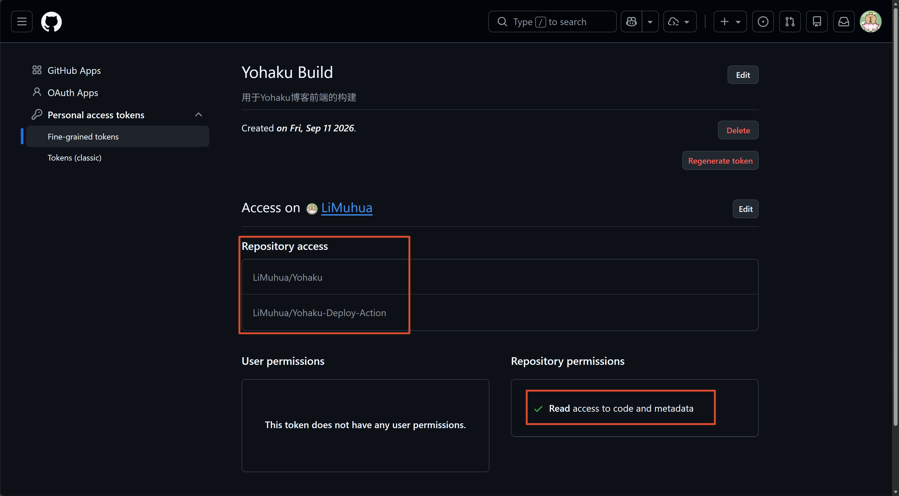
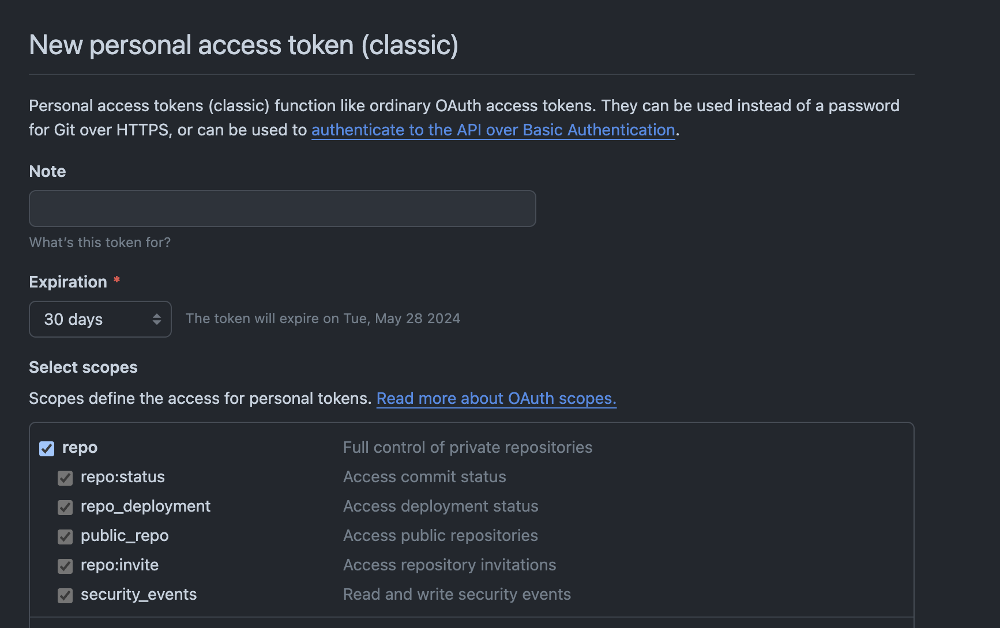

# Yohaku Deploy Action

> **Note:** 本仓库已重命名为 **yohaku-deploy-action**（原名为 `shiroi-deploy-action`）。GitHub 会自动处理旧链接的重定向，原有 fork 和引用不受影响。

这是一个利用 GitHub Action 去构建私有版本站点并部署到远程服务器的工作流。

## Why?

这里的项目关系现在更准确地说是：

- [Yohaku](https://github.com/Innei/Yohaku) 是当前设计语言与视觉体系已经完全重构后的闭源完整实现。
- [Shiro](https://github.com/Innei/Shiro) 是更早期的开源来源项目。
- `Shiroi` 更接近 Yohaku 在大改版之前的历史阶段或兼容称呼；如果你需要旧设计风格，可以切换到 `Shiroi` 对应的历史版本。

开源版本通常提供了预构建的 Docker 镜像或者编译产物可直接使用，但是当前私有完整实现并没有提供。

因为 Next.js build 需要大量内存，很多服务器并吃不消这样的开销。

因此这里提供利用 GitHub Action 去完成构建然后推送到服务器。

你可以使用定时任务去定时更新 Yohaku，或部署旧风格的 Shiroi 历史版本。

## 最近变更

- **仓库重命名**：`shiroi-deploy-action` → `yohaku-deploy-action`。
- **PR #17** 将默认源码仓库从 `innei-dev/shiroi` 修改为 `innei-dev/Yohaku`，以匹配当前主力项目。如果你在部署旧版 Shiroi，请将 `SOURCE_REPO` 改回 `innei-dev/shiroi`。
- 工作流已通用化：源码仓库、构建命令、产物路径均可通过环境变量覆盖，详见下节「配置项」。

## 历史版本参考

如果你需要**部署旧版 Shiroi**，可直接回退到以下历史 commit，或参考当时的配置自行修改：

| Commit                                                                        | 说明                                                                                                                                                                        | 适用场景                                             |
| ------------------------------------------------------------------------------- | ----------------------------------------------------------------------------------------------------------------------------------------------------------------------------- | ------------------------------------------------------ |
| [`bc07cfa`](https://github.com/innei-dev/yohaku-deploy-action/commit/bc07cfa) | **PR #17 之前最后一个 Shiroi 版本**。<br />默认源码仓库为 `innei-dev/shiroi`，部署目录为 `~/shiro`，<br />PM2 应用名 `Shiroi`，构建命令为 `sh ./ci-release-build.sh`。 | **推荐**：如果你只想直接使用旧版 Shiroi 的完整配置。 |
| [`80466cf`](https://github.com/innei-dev/yohaku-deploy-action/commit/80466cf) | standalone + PM2 部署流程修复后的版本。<br />引入了`pm2/ecosystem.config.js` 模板，<br />部署路径对齐为 `standalone/apps/web`。                                             | 如果你需要 standalone 部署模式的修复版本。           |
| [`d495fef`](https://github.com/innei-dev/yohaku-deploy-action/commit/d495fef) | 最初加入`rollback.sh` 的版本。                                                                                                                                              | 如果你想看最早的部署脚本实现。                       |

直接切换到 Shiroi 最后一个可用版本：

```bash
git clone https://github.com/innei-dev/yohaku-deploy-action.git
cd yohaku-deploy-action
git checkout bc07cfa
```

---

## How to

开始之前，你的服务器首先需要安装 Node.js, npm, pnpm, pm2, sharp。

关于 sharp 的安装，你可以使用

```sh
npm i -g sharp
```

sharp 不是必须的，但是在运行过程中会出现报错。参考：[https://nextjs.org/docs/messages/sharp-missing-in-production](https://nextjs.org/docs/messages/sharp-missing-in-production)

部署产物和运行时 `.env` 均保存在服务器的 `BASE_DIR` 中，默认是 `$HOME/yohaku`。通常建议将其配置为独立目录；并将运行时 `.env` 放在该目录下，以免切换后丢失原有的 PM2 入口或环境配置。

在服务器的 `$BASE_DIR/.env` 中填写运行时变量。这份配置参照 `Yohaku/Shiroi` 源码仓库中的 `.env.template`，而非此仓库下用于工作流调试的 `.env.template` 。

```ini
# Env from your private Yohaku/Shiroi repo .env.template

# 站点根地址及前端 API、网关地址；说明见下方「CI 构建配置」。
BASE_URL=

# API 版本应与后端 API_VERSION 一致；详见下方「CI 构建配置」。
NEXT_PUBLIC_API_URL=${BASE_URL}/api/v3
NEXT_PUBLIC_GATEWAY_URL=${BASE_URL}

# Clerk 的前端公开密钥；具体取值参考源码仓库 .env.template。
NEXT_PUBLIC_CLERK_PUBLISHABLE_KEY=

# Clerk 服务端密钥，仅保存在服务器上，不要提交到仓库。
CLERK_SECRET_KEY=

# Clerk 登录、注册及完成后的跳转路径；按站点路由调整。
NEXT_PUBLIC_CLERK_SIGN_IN_URL=/sign-in
NEXT_PUBLIC_CLERK_SIGN_UP_URL=/sign-up
NEXT_PUBLIC_CLERK_AFTER_SIGN_IN_URL=/
NEXT_PUBLIC_CLERK_AFTER_SIGN_UP_URL=/

# TMDB API 密钥；是否需要填写以源码仓库 .env.template 为准。
TMDB_API_KEY=

# 用于访问源码仓库的 Github Token
GH_TOKEN=
```

Fork 此项目，然后你需要填写下面的信息。

## 环境变量

在仓库 **Settings → Secrets and variables → Actions** 中配置以下 Secrets；
本地调试时参考 [env/.env.example](env/.env.example)，通过 `act --secret-file` 注入。

### 工作流配置

| 变量                 | 默认值                                                                                                                                                  | 作用                               | 说明                                                                                   |
| ---------------------- | --------------------------------------------------------------------------------------------------------------------------------------------------------- | ------------------------------------ | ---------------------------------------------------------------------------------------- |
| `SOURCE_REPO`        | `innei-dev/Yohaku`                                                                                                                                      | 源码仓库，格式为`owner/repo`       | 建议改为自己有权访问的 fork；使用私有仓库时，须与`GH_PAT` 可访问的仓库一致。           |
| `BUILD_COMMAND`      | `pnpm --filter @yohaku/web build:ci`                                                                                                                    | 构建命令                           | 可选；工作流随后执行 standalone 打包与 zip；<br />如果你的项目结构不同，可修改此命令。 |
| `STANDALONE_SUBPATH` | `standalone/apps/web`                                                                                                                                   | 部署产物中 standalone 包的相对路径 | 可选；源码仓库结构不同或部署旧版 Shiroi 时按实际产物调整。                             |
| `HASH_FILE`          | `.github/deploy_build_hash`                                                                                                                             | 当前仓库中的构建哈希文件           | 可选；使用仓库相对路径。                                                               |
| `BASE_DIR`           | `$HOME/yohaku`                       |服务器上的部署目录 | 可选；建议设置为独立的绝对路径，运行时环境文件须放在`$BASE_DIR/.env`；已有部署请沿用原目录。 |

### CI 构建配置

| 变量                      | 作用                                      | 说明                                                                                                                                                                                                                                      |
| --------------------------- | ------------------------------------------- | ------------------------------------------------------------------------------------------------------------------------------------------------------------------------------------------------------------------------------------------- |
| `BASE_URL`                | 站点对外根 URL，例如`https://example.com` | 建议不带尾部斜杠；<br />须与服务器 `$BASE_DIR/.env` 及私有仓库 `Dockerfile` / 模板一致。                                                                                                                                                  |
| `NEXT_PUBLIC_API_URL`     | 客户端 API 地址，例如`${BASE_URL}/api/v3` | API 版本须与 mx-space/core 后端的`API_VERSION` 一致，否则构建期 `/aggregate` 等接口可能返回 404；参见 [源码](https://github.com/mx-space/core/blob/master/apps/core/src/app.config.ts)、[迁移文档](https://mx-space.js.org/docs/migrat)  |
| `NEXT_PUBLIC_GATEWAY_URL` | 客户端网关地址，例如`${BASE_URL}`         | 与`BASE_URL` 对应；`NEXT_PUBLIC_*` 会参与 `next build` 并写入客户端 bundle，启用 ISR 时还会影响再验证。                                                                                                                                   |

工作流执行 `next build` 时会注入三个站点 URL 变量，不能仅依赖部署机 `.env` 而忽略 Actions。实际 API 版本以 `apps/core/src/app.config.ts` 中的 `API_VERSION` 为准。

### 连接配置

| 变量                      | 作用                                             | 说明                                                                                   |
| --------------------------- | -------------------------------------------------- | ---------------------------------------------------------------------------------------- |
| `GH_PAT`                  | 读取`SOURCE_REPO` 的 GitHub 访问凭证             | 构建哈希由工作流自动生成的`GITHUB_TOKEN` 回写当前仓库，无需给此 PAT 写权限。           |
| `SSH_PROXY`               | SSH 代理方式                                     | 可选；留空为普通 SSH，使用 Cloudflare Access 时填`cloudflared`；支持扩展其它代理方式。 |
| `HOST`                    | 可达的SSH公网服务器地址                          | 使用 Cloudflare Access 时填写 Cloudflare Tunnel 暴露的 SSH 公网主机名。                |
| `USER`                    | 服务器用户名                                     | 使用具备部署权限的账户。                                                               |
| `PORT`                    | 服务器 SSH 端口                                  | 可选；默认为`22`                                                                       |
| `PASSWORD`                | 服务器密码                                       | 可选；与`KEY` 二选一。                                                                 |
| `KEY`                     | 服务器 SSH 私钥                                  | 可选；与`PASSWORD` 二选一，本地调试时可通过 `act -s KEY` 传入多行私钥。                |
| `CF_ACCESS_CLIENT_ID`     | Cloudflare Access Service Token 的 Client ID     | 可选；仅在`SSH_PROXY=cloudflared` 时必填。                                             |
| `CF_ACCESS_CLIENT_SECRET` | Cloudflare Access Service Token 的 Client Secret | 可选；仅在`SSH_PROXY=cloudflared` 时必填，并在对应策略中允许该 Service Token。         |

设置 `SSH_PROXY=cloudflared` 时，部署 Job 会安装 `cloudflared`，并通过 `cloudflared access ssh` 使用 Service Token 连接服务器。

### 其它配置

| 变量                       | 作用                                    | 说明                                                 |
| ---------------------------- | ----------------------------------------- | ------------------------------------------------------ |
| `BUILD_RATE_LIMIT_RETRIES` | 构建遇到 API 429 时的额外重试次数       | 可选；默认为 3 。                                    |
| `BUILD_RATE_LIMIT_DELAY`   | 构建遇到 API 429 时每次重试前的等待时间 | 可选；默认为60；单位为秒。                           |
| `BUILD_RETENTION_COUNT`    | 保留的最新构建目录数                    | 可选；留空则保留全部，设置时须为正整数。             |
| `AFTER_DEPLOY_SCRIPT`      | 预留的部署后 Shell 命令                 | 可选；当前工作流的执行步骤已注释，设置后也不会运行。 |

---

## 本地调试 Workflow

首次本地调试可使用 [act](https://github.com/nektos/act) 在 Docker 中模拟 GitHub Actions。
Windows 上可使用 `winget install nektos.act` 安装；同时确保 Docker Desktop 已启动，并切换至
Linux containers 模式。

1. 复制 `env/.env.example` 为 `.env`，填写所需 Secrets。`.env` 已被 Git 忽略，切勿提交。
2. 若使用密码认证，或者将私钥文件内容写给`KEY`变量，直接执行：

   ```powershell
   act push --secret-file env\.env -W .github\workflows\deploy.yml
   ```

3. 若使用 SSH 私钥，保持 `.env` 中的 `KEY` 为空，改为在命令中从本机私钥文件传入：

   ```powershell
    act push --secret-file env\.env -s KEY="$(Get-Content -Raw $env:USERPROFILE\.ssh\id_ed25519)" -W .github\workflows\deploy.yml
   ```

首次运行建议先确认构建阶段可完成；该 Workflow 会连接真实的 Cloudflare Tunnel 和部署服务器，因此调试部署步骤将上传产物并重载远端 PM2 服务。
若只想验证工作流解析和 Job 调度，可使用`act -n push`，它不会执行命令。使用 `act` 完整运行时不会向 GitHub 仓库推送构建哈希；在线 GitHub Actions 运行时仍会执行该推送步骤。

## Technical details

### GitHub Token

工作流需要读取 `SOURCE_REPO` 中的源码。对于私有仓库，进入 [Tokens](https://github.com/settings/tokens) 创建 Personal Access Token（PAT），将其保存为当前工作流仓库的 Actions Secret `GH_PAT`。该 PAT 仅负责读取源码，**不需要写入权限**。

部署完成后，工作流使用 GitHub Actions 自动提供的 `GITHUB_TOKEN` 向当前仓库写回构建哈希；无需为此给 `GH_PAT` 增加权限。这两枚 Token 的授权对象和用途不同。

#### Fine-grained

推荐创建 fine-grained personal access token：

1. 将 Resource owner 设为源码仓库所属的用户或组织。
2. 在 Repository access 中选择 `SOURCE_REPO` 对应的仓库；不需要选择本工作流仓库。
3. 将 Repository permissions → Contents 设为 **Read-only**。



如果源码仓库还引用其他私有子模块，Token 也必须能够读取那些仓库；组织仓库可能还要求组织管理员批准该 Token。

#### Classic

仅当 fine-grained PAT 不适用于你的仓库访问场景时再使用 classic PAT。

例如，源码仓库属于其他组织，而你的账号只是该组织仓库的外部协作者。若创建访问上游私有仓库的凭证，可使用自己有权访问的备份并相应修改 `SOURCE_REPO`。

读取私有仓库通常需要选择 `repo` scope。注意：`repo` 不只是读取权限，其授权范围明显大于上述 fine-grained 配置，因此不要为了写回构建哈希而选择。



### Tips

为了让 PM2 在服务器重启之后能够还原进程。可以使用：

```sh
pm2 startup
pm2 save
```

如果区分了 SSH 部署用户，应确保 PM2 应用始终以该部署用户身份管理；详见[删除构建记录失败](./docs/deployment-guide.md#5.1.4 删除构建记录失败)。

### Reference

> [跨仓库全自动构建项目并部署到服务器](./docs/post.md)
> [Yohaku 全流程部署实践记录](./docs/deployment-guide.md)
